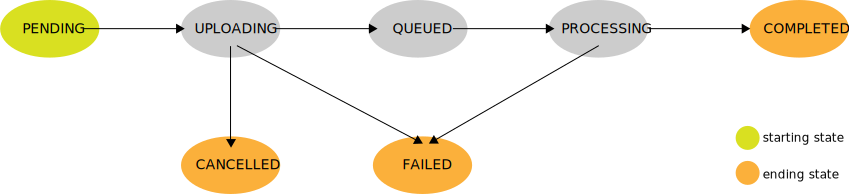

# Video Status

A video could be in different states during its lifetime inside the streaming service.

The [next diagram](./assets/video-states.svg) shows the possible states and how can evolve.

The _pending_ status is the default status of the video, as when it is created in system the file is not yet uploaded. 

The _uploading_ status indicates that the video file is being uploaded. A video enters this state if the Tus upload is started.

After the upload completes the video will be _queued_ in the video processing pipeline. When the pipeline process the video it is reflected by the _processing_ state.

A video can enter the _cancelled_ state if the upload is cancelled (e.g. by the user).

The _failed_ state can be reached if the upload failed or if the video processing failed. 

In any other cases, at the end of the processing, the video will be in the _completed_ state.
